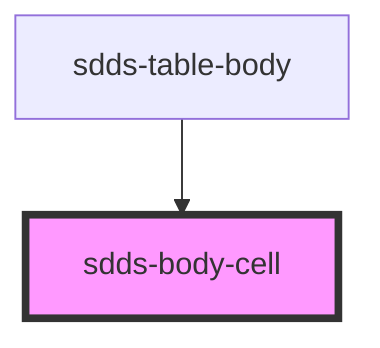

# sdds-body-cell

<!-- Auto Generated Below -->

## Properties

| Property         | Attribute         | Description                                                                                                     | Type               | Default     |
| ---------------- | ----------------- | --------------------------------------------------------------------------------------------------------------- | ------------------ | ----------- |
| `cellKey`        | `cell-key`        | Passing same cell key for all body cells which is used in head cell enables features of text align and hovering | `any`              | `undefined` |
| `cellValue`      | `cell-value`      | Value that will be presented as text inside a cell                                                              | `number \| string` | `undefined` |
| `disablePadding` | `disable-padding` | Disables internal padding. Useful when passing other components to cell.                                        | `boolean`          | `false`     |

## Dependencies

### Used by

 - [sdds-table-body](../table-body)

### Graph

----------------------------------------------

*Built with [StencilJS](https://stenciljs.com/)*
