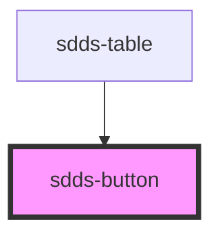

# sdds-button

<!-- Auto Generated Below -->

## Properties

| Property    | Attribute   | Description | Type      | Default     |
| ----------- | ----------- | ----------- | --------- | ----------- |
| `disabled`  | `disabled`  |             | `boolean` | `undefined` |
| `fullbleed` | `fullbleed` |             | `boolean` | `undefined` |
| `size`      | `size`      |             | `string`  | `''`        |
| `text`      | `text`      |             | `string`  | `undefined` |
| `type`      | `type`      |             | `string`  | `undefined` |

## Dependencies

### Used by

 - [sdds-table](../table)

### Graph

----------------------------------------------

*Built with [StencilJS](https://stenciljs.com/)*
