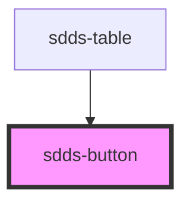

# sdds-button

<!-- Auto Generated Below -->

## Properties

| Property    | Attribute   | Description                                | Type                                              | Default     |
| ----------- | ----------- | ------------------------------------------ | ------------------------------------------------- | ----------- |
| `disabled`  | `disabled`  | Control for disabled state of component    | `boolean`                                         | `false`     |
| `fullbleed` | `fullbleed` | When enabled, makes button take 100% width | `boolean`                                         | `false`     |
| `size`      | `size`      | Size of button                             | `"" \| "md" \| "sm"`                              | `''`        |
| `text`      | `text`      | Text inside a button                       | `string`                                          | `''`        |
| `type`      | `type`      | Type of button                             | `"danger" \| "ghost" \| "primary" \| "secondary"` | `'primary'` |

## Dependencies

### Used by

 - [sdds-table](../table)

### Graph

----------------------------------------------

*Built with [StencilJS](https://stenciljs.com/)*
