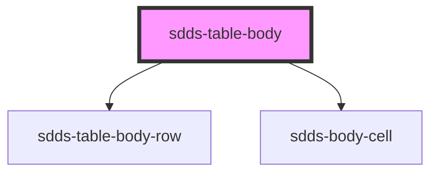

# sdds-table-body

<!-- Auto Generated Below -->

## Properties

| Property                    | Attribute                     | Description                                                                                                                                                             | Type      | Default     |
| --------------------------- | ----------------------------- | ----------------------------------------------------------------------------------------------------------------------------------------------------------------------- | --------- | ----------- |
| `bodyData`                  | `body-data`                   | Prop to pass JSON string which enables automatic rendering of table rows and cells                                                                                      | `any`     | `undefined` |
| `disableFilteringFunction`  | `disable-filtering-function`  | Disables inbuilt filtering logic, leaving user an option to create own filter functionality while listening to events from sdds-table-toolbar component for search term | `boolean` | `false`     |
| `disablePaginationFunction` | `disable-pagination-function` | Disables inbuilt pagination logic, leaving user an option to create own pagination functionality while listening to events from sdds-table-footer component             | `boolean` | `false`     |
| `disableSortingFunction`    | `disable-sorting-function`    | Disables inbuilt sorting logic, leaving user an option to create own sorting functionality while listening to events from sdds-header-cell component for sorting        | `boolean` | `false`     |
| `enableDummyData`           | `enable-dummy-data`           | Prop for showcase of rendering JSON in body-data, just for presentation purposes                                                                                        | `boolean` | `false`     |

## Events

| Event                       | Description                                                                                                                                                | Type               |
| --------------------------- | ---------------------------------------------------------------------------------------------------------------------------------------------------------- | ------------------ |
| `sortingSwitcherEvent`      | Event that sends unique table identifier and enable/disable status for sorting functionality                                                               | `CustomEvent<any>` |
| `tableToFooterEvent`        | Sends unique table identifier, columns number, number of pages and temporarily disable state of pagination to the sdds-table-footer component              | `CustomEvent<any>` |
| `updateBodyCheckboxesEvent` | Sends unique table identifier and mainCheckbox status to all rows when multiselect feature is enabled                                                      | `CustomEvent<any>` |
| `updateMainCheckboxEvent`   | Sends unique table identifier and status if mainCheckbox should change its state based on selection status of single rows when multiselect feature is used | `CustomEvent<any>` |

## Dependencies

### Depends on

- [sdds-table-body-row](../table-body-row)
- [sdds-body-cell](../table-body-cell)

### Graph

----------------------------------------------

*Built with [StencilJS](https://stenciljs.com/)*
