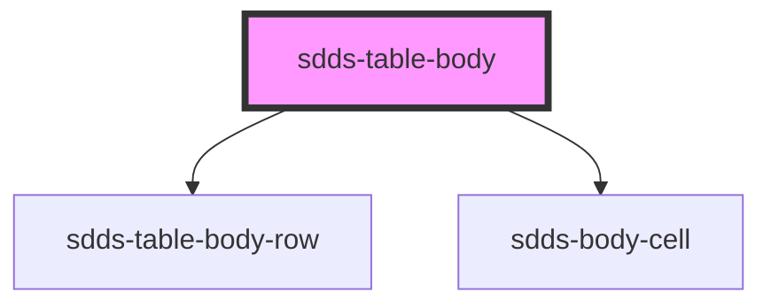

# sdds-table-body

<!-- Auto Generated Below -->

## Properties

| Property                    | Attribute                     | Description                                                                                                                                                             | Type      | Default                                                                                                                                                                                                                                                                                                                                                                                                                                                                                                                                                                                                                                                                                                                                                                                                                                                                                                                                                                                                                                                 |
| --------------------------- | ----------------------------- | ----------------------------------------------------------------------------------------------------------------------------------------------------------------------- | --------- | ------------------------------------------------------------------------------------------------------------------------------------------------------------------------------------------------------------------------------------------------------------------------------------------------------------------------------------------------------------------------------------------------------------------------------------------------------------------------------------------------------------------------------------------------------------------------------------------------------------------------------------------------------------------------------------------------------------------------------------------------------------------------------------------------------------------------------------------------------------------------------------------------------------------------------------------------------------------------------------------------------------------------------------------------------- |
| `bodyData`                  | `body-data`                   | Prop to pass JSON string which enables automatic rendering of table rows and cells                                                                                      | `any`     | ``[       {           "truck": "L-series",           "driver": "Sonya Bruce",           "country": "Brazil",           "mileage": 123987       },       {           "truck": "P-series",           "driver": "Guerra Bowman",           "country": "Sweden",           "mileage": 2000852       },       {           "truck": "G-series",           "driver": "Ferrell Wallace",           "country": "Germany",           "mileage": 564       },       {           "truck": "R-series",           "driver": "Cox Burris",           "country": "Spain",           "mileage": 1789357       },       {           "truck": "S-series",           "driver": "Montgomery Cervantes",           "country": "Croatia",           "mileage": 65       },       {           "truck": "L-series",           "driver": "Sheryl Nielsen",           "country": "Greece",           "mileage": 365784       },       {           "truck": "G-series",           "driver": "Benton Gomez",           "country": "France",           "mileage": 80957       }   ]`` |
| `disableFilteringFunction`  | `disable-filtering-function`  | Disables inbuilt filtering logic, leaving user an option to create own filter functionality while listening to events from sdds-table-toolbar component for search term | `boolean` | `false`                                                                                                                                                                                                                                                                                                                                                                                                                                                                                                                                                                                                                                                                                                                                                                                                                                                                                                                                                                                                                                                 |
| `disablePaginationFunction` | `disable-pagination-function` | Disables inbuilt pagination logic, leaving user an option to create own pagination functionality while listening to events from sdds-table-footer component             | `boolean` | `false`                                                                                                                                                                                                                                                                                                                                                                                                                                                                                                                                                                                                                                                                                                                                                                                                                                                                                                                                                                                                                                                 |
| `disableSortingFunction`    | `disable-sorting-function`    | Disables inbuilt sorting logic, leaving user an option to create own sorting functionality while listening to events from sdds-header-cell component for sorting        | `boolean` | `false`                                                                                                                                                                                                                                                                                                                                                                                                                                                                                                                                                                                                                                                                                                                                                                                                                                                                                                                                                                                                                                                 |

## Events

| Event                       | Description | Type               |
| --------------------------- | ----------- | ------------------ |
| `sortingSwitcherEvent`      |             | `CustomEvent<any>` |
| `tableToFooterEvent`        |             | `CustomEvent<any>` |
| `updateBodyCheckboxesEvent` |             | `CustomEvent<any>` |
| `updateMainCheckboxEvent`   |             | `CustomEvent<any>` |

## Dependencies

### Depends on

- [sdds-table-body-row](../table-body-row)
- [sdds-body-cell](../table-body-cell)

### Graph

----------------------------------------------

*Built with [StencilJS](https://stenciljs.com/)*
