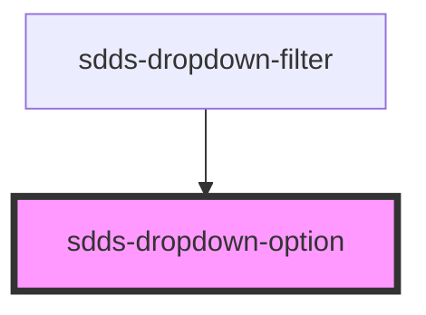

# sdds-dropdown

```html
<sdds-dropdown 
    size="large"
    label="Select option"
    disabled="false"
    label-position="no-label"
    helper="Helper text"
    state="default">
    <sdds-dropdown-option value="option-1">Option 1</sdds-dropdown-option>
    <sdds-dropdown-option value="option-2">Option 2</sdds-dropdown-option>
    <sdds-dropdown-option value="option-3">Option 3</sdds-dropdown-option>
</sdds-dropdown>
```

<!-- Auto Generated Below -->


## Properties

| Property | Attribute | Description                                                      | Type     | Default     |
| -------- | --------- | ---------------------------------------------------------------- | -------- | ----------- |
| `value`  | `value`   | Value is a unique string that will be used for application logic | `string` | `undefined` |


## Events

| Event          | Description | Type               |
| -------------- | ----------- | ------------------ |
| `selectOption` |             | `CustomEvent<any>` |


## Dependencies

### Used by

 - [sdds-dropdown-filter](../../patterns/dropdown-filter)

### Graph


----------------------------------------------

*Built with [StencilJS](https://stenciljs.com/)*
