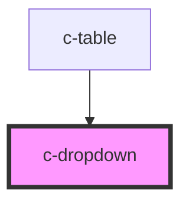

# c-dropdown

<!-- Auto Generated Below -->

## Properties

| Property        | Attribute        | Description                                                         | Type     | Default     |
| --------------- | ---------------- | ------------------------------------------------------------------- | -------- | ----------- |
| `buttonType`    | `button-type`    | Button interaction pattern for dropdown                             | `string` | `"primary"` |
| `direction`     | `direction`      | Dropdown direction: dropup, dropright, dropleft                     | `string` | `undefined` |
| `menuAlignment` | `menu-alignment` | Custom dropdown menu alignment: dropdown-menu-right                 | `string` | `undefined` |
| `theme`         | `theme`          | Per default, this will inherit the value from c-theme name property | `string` | `undefined` |

## Dependencies

### Used by

 - [c-table](../table)

### Graph

----------------------------------------------

*Built with [StencilJS](https://stenciljs.com/)*
