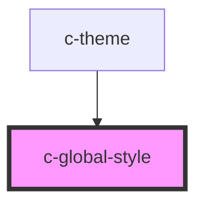

# c-global-style

<!-- Auto Generated Below -->

## Properties

| Property | Attribute | Description                                                         | Type     | Default     |
| -------- | --------- | ------------------------------------------------------------------- | -------- | ----------- |
| `theme`  | `theme`   | Per default, this will inherit the value from c-theme name property | `string` | `undefined` |

## Dependencies

### Used by

 - [c-theme](../theme)

### Graph

----------------------------------------------

*Built with [StencilJS](https://stenciljs.com/)*
