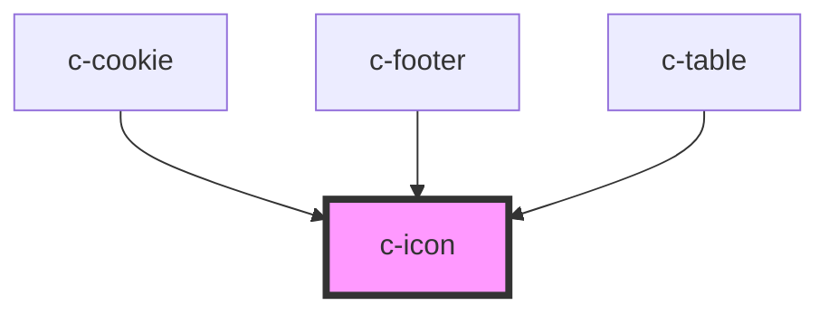

# c-icon

<!-- Auto Generated Below -->

## Properties

| Property | Attribute | Description | Type     | Default      |
| -------- | --------- | ----------- | -------- | ------------ |
| `name`   | `name`    |             | `string` | `'question'` |

## Dependencies

### Used by

 - [c-cookie](../../patterns/cookie)
 - [c-footer](../../patterns/footer)
 - [c-table](../table)

### Graph

----------------------------------------------

*Built with [StencilJS](https://stenciljs.com/)*
