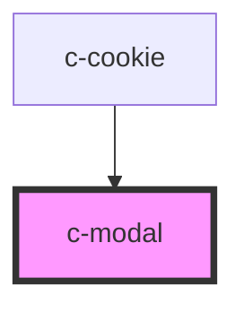

# c-modal

<!-- Auto Generated Below -->

## Properties

| Property | Attribute | Description                                                         | Type      | Default     |
| -------- | --------- | ------------------------------------------------------------------- | --------- | ----------- |
| `close`  | `close`   | Add close icon in modal                                             | `boolean` | `true`      |
| `config` | `config`  | Bootstrap modal config                                              | `any`     | `undefined` |
| `event`  | `event`   |                                                                     | `any`     | `undefined` |
| `open`   | `open`    | Set to true to open modal                                           | `boolean` | `undefined` |
| `theme`  | `theme`   | Per default, this will inherit the value from c-theme name property | `string`  | `undefined` |

## Dependencies

### Used by

 - [c-cookie](../../patterns/cookie)

### Graph

----------------------------------------------

*Built with [StencilJS](https://stenciljs.com/)*
