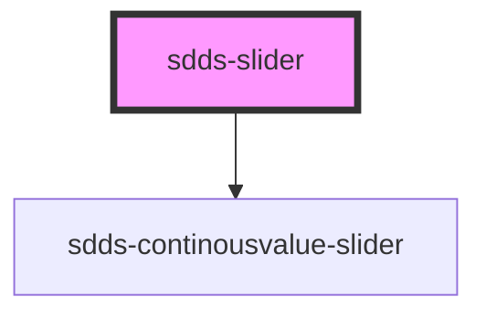

# sdds-slider

<!-- Auto Generated Below -->

## Properties

| Property   | Attribute   | Description | Type     | Default     |
| ---------- | ----------- | ----------- | -------- | ----------- |
| `max`      | `max`       |             | `string` | `'100'`     |
| `min`      | `min`       |             | `string` | `'0'`       |
| `type`     | `type`      |             | `string` | `undefined` |
| `value`    | `value`     |             | `string` | `'20'`      |
| `valueTwo` | `value-two` |             | `string` | `'70'`      |

## Dependencies

### Depends on

- [sdds-continousvalue-slider](.)

### Graph

----------------------------------------------

*Built with [StencilJS](https://stenciljs.com/)*
