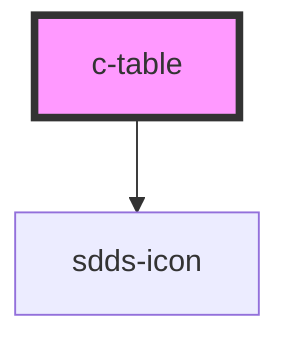

# c-table

<!-- Auto Generated Below -->

## Properties

| Property          | Attribute           | Description | Type       | Default               |
| ----------------- | ------------------- | ----------- | ---------- | --------------------- |
| `content`         | --                  |             | `any[]`    | `[]`                  |
| `descrCustomLink` | `descr-custom-link` |             | `string`   | `undefined`           |
| `hasDelete`       | `has-delete`        |             | `boolean`  | `undefined`           |
| `hasEdit`         | `has-edit`          |             | `boolean`  | `undefined`           |
| `hasHover`        | `has-hover`         |             | `boolean`  | `undefined`           |
| `header`          | --                  |             | `Header[]` | `new Array<Header>()` |
| `tblClass`        | `tbl-class`         |             | `string`   | `undefined`           |

## Events

| Event           | Description | Type               |
| --------------- | ----------- | ------------------ |
| `optCustomLink` |             | `CustomEvent<any>` |
| `optDelete`     |             | `CustomEvent<any>` |
| `optEdit`       |             | `CustomEvent<any>` |
| `optHover`      |             | `CustomEvent<any>` |

## Dependencies

### Depends on

- [sdds-icon](../icon)

### Graph

----------------------------------------------

*Built with [StencilJS](https://stenciljs.com/)*
