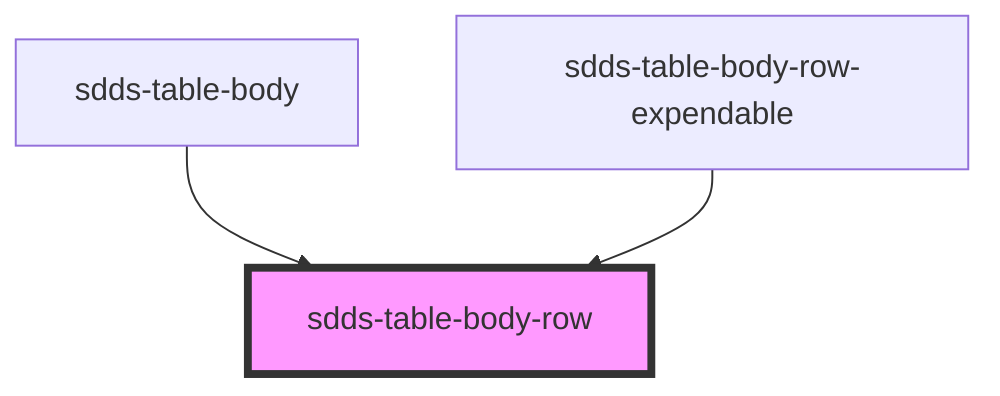

# sdds-table-body-row

<!-- Auto Generated Below -->

## Events

| Event            | Description                                                                                                             | Type                   |
| ---------------- | ----------------------------------------------------------------------------------------------------------------------- | ---------------------- |
| `bodyRowToTable` | Send status of single row to the parent, sdds-table component that hold logic for data export and main checkbox control | `CustomEvent<boolean>` |

## Dependencies

### Used by

 - [sdds-table-body](../table-body)
 - [sdds-table-body-row-expendable](..)

### Graph

----------------------------------------------

*Built with [StencilJS](https://stenciljs.com/)*
