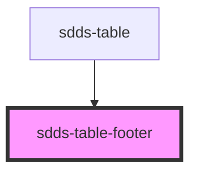

# sdds-table-footer

<!-- Auto Generated Below -->

## Events

| Event           | Description                                     | Type                  |
| --------------- | ----------------------------------------------- | --------------------- |
| `footerToTable` | Event to send current pagination back to parent | `CustomEvent<number>` |

## Dependencies

### Used by

 - [sdds-table](..)

### Graph

----------------------------------------------

*Built with [StencilJS](https://stenciljs.com/)*
