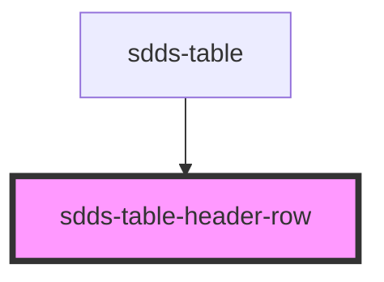

# sdds-table-header-row

<!-- Auto Generated Below -->

## Events

| Event            | Description                                                                | Type                   |
| ---------------- | -------------------------------------------------------------------------- | ---------------------- |
| `headRowToTable` | Send status of main checkbox in header to the parent, sdds-table component | `CustomEvent<boolean>` |

## Dependencies

### Used by

 - [sdds-table](..)

### Graph

----------------------------------------------

*Built with [StencilJS](https://stenciljs.com/)*
