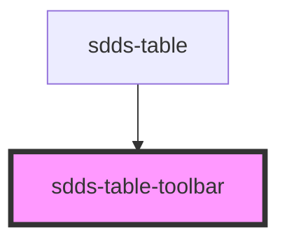

# sdds-table-toolbar

<!-- Auto Generated Below -->

## Properties

| Property          | Attribute           | Description                                    | Type      | Default |
| ----------------- | ------------------- | ---------------------------------------------- | --------- | ------- |
| `enableActionBar` | `enable-action-bar` | Enables section for adding user custom buttons | `boolean` | `false` |
| `showSearchbar`   | `show-searchbar`    | Enables preview of searchbar                   | `boolean` | `true`  |
| `tableTitle`      | `table-title`       | Adds title to the table                        | `string`  | `''`    |

## Events

| Event                 | Description                                                        | Type               |
| --------------------- | ------------------------------------------------------------------ | ------------------ |
| `sddsTableSearchTerm` | Used for sending users input to main parent <sdds-table> component | `CustomEvent<any>` |

## Dependencies

### Used by

 - [sdds-table](..)

### Graph

----------------------------------------------

*Built with [StencilJS](https://stenciljs.com/)*
