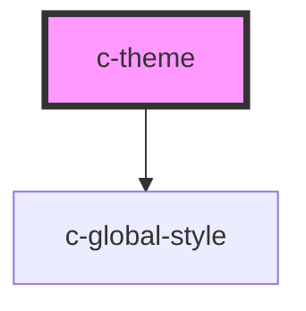

# c-theme

<!-- Auto Generated Below -->

## Properties

| Property | Attribute | Description                                                           | Type      | Default     |
| -------- | --------- | --------------------------------------------------------------------- | --------- | ----------- |
| `global` | `global`  | By setting this to true bootstrap classes will be accessable globally | `boolean` | `false`     |
| `name`   | `name`    | Set the brand name that will set the theme styling for the page.      | `string`  | `undefined` |

## Dependencies

### Depends on

- [c-global-style](../global-style)

### Graph

----------------------------------------------

*Built with [StencilJS](https://stenciljs.com/)*
