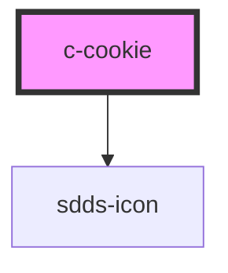

# c-cookie

<!-- Auto Generated Below -->

## Properties

| Property               | Attribute                | Description                                                            | Type                                     | Default                             |
| ---------------------- | ------------------------ | ---------------------------------------------------------------------- | ---------------------------------------- | ----------------------------------- |
| `activeText`           | `active-text`            |                                                                        | `string`                                 | `'Active'`                          |
| `headline`             | `headline`               |                                                                        | `string`                                 | `'Confidentiality agreement'`       |
| `inline`               | `inline`                 |                                                                        | `boolean`                                | `undefined`                         |
| `introHeadline`        | `intro-headline`         |                                                                        | `any`                                    | `undefined`                         |
| `introText`            | `intro-text`             |                                                                        | `any`                                    | `undefined`                         |
| `mainButtonPrimary`    | `main-button-primary`    |                                                                        | `string`                                 | `'Accept'`                          |
| `mainButtonSecondary`  | `main-button-secondary`  |                                                                        | `string`                                 | `'Cookie settings'`                 |
| `modalButtonPrimary`   | `modal-button-primary`   |                                                                        | `string`                                 | `'Save preferences'`                |
| `modalButtonSecondary` | `modal-button-secondary` |                                                                        | `string`                                 | `'Cancel'`                          |
| `open`                 | `open`                   |                                                                        | `boolean`                                | `undefined`                         |
| `options`              | --                       |                                                                        | `{ expires: number; sameSite: string; }` | `{ expires: 365, sameSite: 'lax' }` |
| `theme`                | `theme`                  | Per default, this will inherit the value from sdds-theme name property | `string`                                 | `undefined`                         |

## Dependencies

### Depends on

- [sdds-icon](../../components/icon)

### Graph

----------------------------------------------

*Built with [StencilJS](https://stenciljs.com/)*
