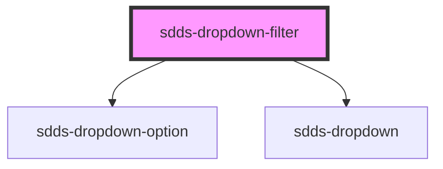

# sdds-dropdown-filter

<!-- Auto Generated Below -->

## Properties

| Property        | Attribute        | Description                                                                                                                              | Type      | Default      |
| --------------- | ---------------- | ---------------------------------------------------------------------------------------------------------------------------------------- | --------- | ------------ |
| `data`          | `data`           | Data is an array of objects that contains label and value `data = [{label:'Option 1', value:'opt-1'},{label:'Option 2', value:'opt-2'}]` | `string`  | `undefined`  |
| `defaultOption` | `default-option` | Add the value of the option to set it as default                                                                                         | `string`  | `undefined`  |
| `disabled`      | `disabled`       | Add the value of the option to set it as default                                                                                         | `boolean` | `undefined`  |
| `helper`        | `helper`         | Add helper text in the bottom of dropdown                                                                                                | `string`  | `''`         |
| `inline`        | `inline`         | Set to true to make the width following the label text length                                                                            | `boolean` | `false`      |
| `label`         | `label`          | Label for dropdown with no selected item                                                                                                 | `string`  | `undefined`  |
| `labelPosition` | `label-position` | Position of label: `no-label` (default), `inside`, `outside`                                                                             | `string`  | `'no-label'` |
| `placeholder`   | `placeholder`    | Placeholder text for dropdown with no selected item                                                                                      | `string`  | `''`         |
| `size`          | `size`           | `large` (default), `small`, `medium`                                                                                                     | `string`  | `'large'`    |
| `state`         | `state`          | Support `error` state                                                                                                                    | `string`  | `'default'`  |

## Dependencies

### Depends on

- [sdds-dropdown-option](../../components/dropdown)
- [sdds-dropdown](../../components/dropdown)

### Graph

----------------------------------------------

*Built with [StencilJS](https://stenciljs.com/)*
