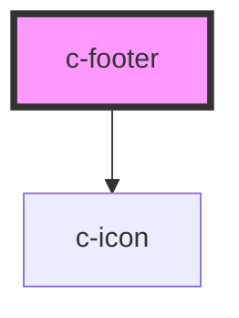

# c-footer

<!-- Auto Generated Below -->

## Properties

| Property      | Attribute      | Description                                                         | Type     | Default                     |
| ------------- | -------------- | ------------------------------------------------------------------- | -------- | --------------------------- |
| `items`       | `items`        | Set footer links                                                    | `any`    | `[]`                        |
| `socialItems` | `social-items` | Add social media icons                                              | `any`    | `[]`                        |
| `text`        | `text`         | Change default copyright text                                       | `string` | `'Copyright © Scania 2019'` |
| `theme`       | `theme`        | Per default, this will inherit the value from c-theme name property | `string` | `undefined`                 |

## Dependencies

### Depends on

- [c-icon](../../components/icon)

### Graph

----------------------------------------------

*Built with [StencilJS](https://stenciljs.com/)*
