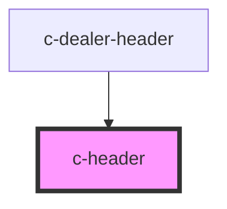

# c-header

```js
import { CHeader } from '@sdds/components/dist/custom-elements';
```


<!-- Auto Generated Below -->


## Properties

| Property    | Attribute    | Description                                                                            | Type     | Default     |
| ----------- | ------------ | -------------------------------------------------------------------------------------- | -------- | ----------- |
| `items`     | `items`      | Header links that will be placed in the top right part of the header                   | `any`    | `[]`        |
| `shortName` | `short-name` | Short name will be displayed in the top-centered of the header on mobile mode          | `string` | `undefined` |
| `siteName`  | `site-name`  | The site name will be displayed on the right hand side of the logotype on desktop mode | `string` | `undefined` |
| `siteUrl`   | `site-url`   | A link that will be applied to the site-name                                           | `string` | `'/'`       |
| `theme`     | `theme`      | Per default, this will inherit the value from sdds-theme name property                 | `string` | `undefined` |
| `variation` | `variation`  | Variation to header                                                                    | `string` | `undefined` |


## Dependencies

### Used by

 - [c-dealer-header](../dealer-header)

### Graph


----------------------------------------------

*Built with [StencilJS](https://stenciljs.com/)*
