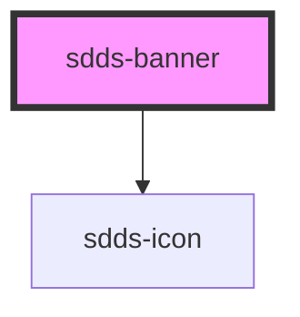

# sdds-banner

<!-- Auto Generated Below -->

## Properties

| Property    | Attribute   | Description | Type                                 | Default     |
| ----------- | ----------- | ----------- | ------------------------------------ | ----------- |
| `header`    | `header`    |             | `string`                             | `undefined` |
| `icon`      | `icon`      |             | `string`                             | `undefined` |
| `linkHref`  | `link-href` |             | `string`                             | `undefined` |
| `linkText`  | `link-text` |             | `string`                             | `undefined` |
| `state`     | `state`     |             | `"error" \| "information" \| "none"` | `'none'`    |
| `subheader` | `subheader` |             | `string`                             | `undefined` |

## Dependencies

### Depends on

- [sdds-icon](../icon)

### Graph

----------------------------------------------

*Built with [StencilJS](https://stenciljs.com/)*
