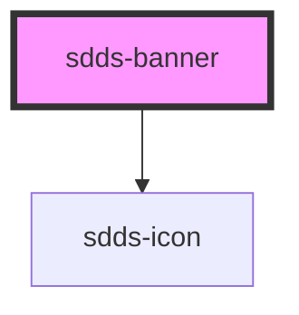

# sdds-banner

<!-- Auto Generated Below -->

## Properties

| Property    | Attribute   | Description                                                                                                                                                                                                                                        | Type                                 | Default               |
| ----------- | ----------- | -------------------------------------------------------------------------------------------------------------------------------------------------------------------------------------------------------------------------------------------------- | ------------------------------------ | --------------------- |
| `bannerId`  | `banner-id` | ID used for internal table functionality and events, must be unique.  **NOTE**: If you're listening for banner close events you need to set this ID yourself to identify the banner, as the default ID is random and will be different every time. | `string`                             | `crypto.randomUUID()` |
| `header`    | `header`    | Header text.                                                                                                                                                                                                                                       | `string`                             | `undefined`           |
| `icon`      | `icon`      | Name of the icon for the component.                                                                                                                                                                                                                | `string`                             | `undefined`           |
| `linkHref`  | `link-href` | Href for the link                                                                                                                                                                                                                                  | `string`                             | `undefined`           |
| `linkText`  | `link-text` | Link text.                                                                                                                                                                                                                                         | `string`                             | `undefined`           |
| `state`     | `state`     | State of the banner                                                                                                                                                                                                                                | `"error" \| "information" \| "none"` | `'none'`              |
| `subheader` | `subheader` | Subheader text.                                                                                                                                                                                                                                    | `string`                             | `undefined`           |

## Events

| Event                  | Description                                                     | Type               |
| ---------------------- | --------------------------------------------------------------- | ------------------ |
| `sddsBannerCloseEvent` | Sends unique banner identifier when the close button is pressed | `CustomEvent<any>` |

## Methods

### `hideBanner() => Promise<{ bannerId: string; visible: boolean; }>`

#### Returns

Type: `Promise<{ bannerId: string; visible: boolean; }>`

### `showBanner() => Promise<{ bannerId: string; visible: boolean; }>`

#### Returns

Type: `Promise<{ bannerId: string; visible: boolean; }>`

## Dependencies

### Depends on

- [sdds-icon](../icon)

### Graph

----------------------------------------------

*Built with [StencilJS](https://stenciljs.com/)*
