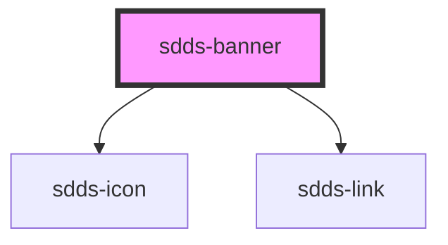

# sdds-banner

<!-- Auto Generated Below -->

## Properties

| Property     | Attribute     | Description                                                                                                                                                                                                                                        | Type                                         | Default               |
| ------------ | ------------- | -------------------------------------------------------------------------------------------------------------------------------------------------------------------------------------------------------------------------------------------------- | -------------------------------------------- | --------------------- |
| `bannerId`   | `banner-id`   | ID used for internal table functionality and events, must be unique.  **NOTE**: If you're listening for banner close events you need to set this ID yourself to identify the banner, as the default ID is random and will be different every time. | `string`                                     | `crypto.randomUUID()` |
| `header`     | `header`      | Header text.                                                                                                                                                                                                                                       | `string`                                     | `undefined`           |
| `hidden`     | `hidden`      | Hides the banner                                                                                                                                                                                                                                   | `boolean`                                    | `false`               |
| `icon`       | `icon`        | Name of the icon for the component. For error and information type the icon is predefined.                                                                                                                                                         | `string`                                     | `undefined`           |
| `linkHref`   | `link-href`   | Href for the link                                                                                                                                                                                                                                  | `string`                                     | `undefined`           |
| `linkRel`    | `link-rel`    | 'noopener' is a security measure for legacy browsers that preventsthe opened page from getting access to the original page when using target='_blank'.                                                                                             | `string`                                     | `'noopener'`          |
| `linkTarget` | `link-target` | Where to open the linked URL                                                                                                                                                                                                                       | `"_blank" \| "_parent" \| "_self" \| "_top"` | `'_self'`             |
| `linkText`   | `link-text`   | Link text.                                                                                                                                                                                                                                         | `string`                                     | `undefined`           |
| `persistent` | `persistent`  | Removes the close button on the banner.                                                                                                                                                                                                            | `boolean`                                    | `false`               |
| `subheader`  | `subheader`   | Subheader text.                                                                                                                                                                                                                                    | `string`                                     | `undefined`           |
| `type`       | `type`        | Type of banner                                                                                                                                                                                                                                     | `"error" \| "information" \| "none"`         | `'none'`              |

## Events

| Event       | Description                                                      | Type                                                  |
| ----------- | ---------------------------------------------------------------- | ----------------------------------------------------- |
| `sddsClose` | Sends unique banner identifier when the close button is pressed. | `CustomEvent<{ bannerId: string; hidden: boolean; }>` |

## Methods

### `hideBanner() => Promise<{ bannerId: string; hidden: boolean; }>`

Hides the banner.

#### Returns

Type: `Promise<{ bannerId: string; hidden: boolean; }>`

### `showBanner() => Promise<{ bannerId: string; hidden: boolean; }>`

Shows the banner

#### Returns

Type: `Promise<{ bannerId: string; hidden: boolean; }>`

## Dependencies

### Depends on

- [sdds-icon](../icon)
- [sdds-link](../link)

### Graph

----------------------------------------------

*Built with [StencilJS](https://stenciljs.com/)*
