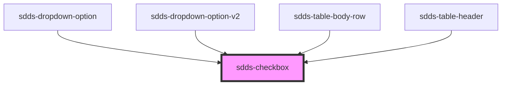

# sdds-checkbox

<!-- Auto Generated Below -->

## Properties

| Property     | Attribute     | Description                                                               | Type      | Default               |
| ------------ | ------------- | ------------------------------------------------------------------------- | --------- | --------------------- |
| `checkboxId` | `checkbox-id` | ID for the checkbox's input element. Randomly generated if not specified. | `string`  | `crypto.randomUUID()` |
| `checked`    | `checked`     | Sets the checkbox as checked                                              | `boolean` | `false`               |
| `disabled`   | `disabled`    | Sets the checkbox in a disabled state                                     | `boolean` | `false`               |
| `name`       | `name`        | Name for the checkbox's input element.                                    | `string`  | `undefined`           |
| `required`   | `required`    | Make the checkbox required                                                | `boolean` | `false`               |
| `value`      | `value`       | Value for the checkbox                                                    | `string`  | `undefined`           |

## Events

| Event        | Description                                                                       | Type                                                                     |
| ------------ | --------------------------------------------------------------------------------- | ------------------------------------------------------------------------ |
| `sddsBlur`   | Blur event for the checkbox                                                       | `CustomEvent<FocusEvent>`                                                |
| `sddsChange` | Sends unique checkbox identifier and checked status when it is checked/unchecked. | `CustomEvent<{ checkboxId: string; checked: boolean; value?: string; }>` |
| `sddsFocus`  | Focus event for the checkbox                                                      | `CustomEvent<FocusEvent>`                                                |

## Methods

### `toggleCheckbox() => Promise<{ checkboxId: string; checked: boolean; }>`

Toggles the checked value of the component.

#### Returns

Type: `Promise<{ checkboxId: string; checked: boolean; }>`

## Dependencies

### Used by

 - [sdds-dropdown-option](../dropdown/dropdown-option)
 - [sdds-dropdown-option-v2](../dropdown-v2/dropdown-option-v2)
 - [sdds-table-body-row](../data-table/table-body-row)
 - [sdds-table-header](../data-table/table-header)

### Graph

----------------------------------------------

*Built with [StencilJS](https://stenciljs.com/)*
