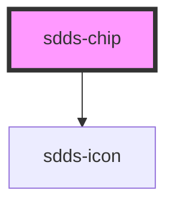

# sdds-chip

<!-- Auto Generated Below -->

## Properties

| Property       | Attribute       | Description                                                                            | Type                                          | Default               |
| -------------- | --------------- | -------------------------------------------------------------------------------------- | --------------------------------------------- | --------------------- |
| `active`       | `active`        | Sets the component to an active state.                                                 | `boolean`                                     | `false`               |
| `chipId`       | `chip-id`       | ID for the chip input element. Randomly generated if not specified.                    | `string`                                      | `crypto.randomUUID()` |
| `icon`         | `icon`          | Name of the icon to be displayed in the chip, if null no icon is displayed             | `string`                                      | `undefined`           |
| `iconPosition` | `icon-position` | Position of the icon                                                                   | `"left" \| "right"`                           | `'left'`              |
| `name`         | `name`          | (Radio/Checkbox): Name for input element                                               | `string`                                      | `undefined`           |
| `size`         | `size`          | Size of the chip                                                                       | `"lg" \| "sm"`                                | `'lg'`                |
| `type`         | `type`          | Sets the type of input for the chip. To not have it as an input element, choose `none` | `"button" \| "checkbox" \| "none" \| "radio"` | `'none'`              |
| `value`        | `value`         | (Radio/Checkbox): Value for input element                                              | `string`                                      | `undefined`           |

## Events

| Event        | Description                                                                                                                                                          | Type                                                                |
| ------------ | -------------------------------------------------------------------------------------------------------------------------------------------------------------------- | ------------------------------------------------------------------- |
| `sddsChange` | Event for type radio/checkbox that sends unique chip identifier and value when selected. For checkbox the event is also broadcasted when the checkbox is unselected. | `CustomEvent<{ chipId: string; value: string; active?: boolean; }>` |
| `sddsClick`  | Event for type button that sends unique chip identifier and active state when clicked.                                                                               | `CustomEvent<{ chipId: string; }>`                                  |

## Dependencies

### Depends on

- [sdds-icon](../icon)

### Graph

----------------------------------------------

*Built with [StencilJS](https://stenciljs.com/)*
