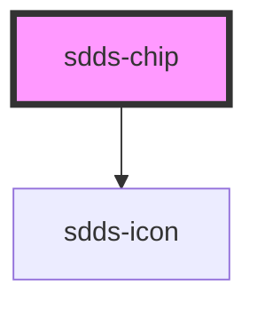

# sdds-chip

<!-- Auto Generated Below -->

## Properties

| Property       | Attribute       | Description | Type                                          | Default               |
| -------------- | --------------- | ----------- | --------------------------------------------- | --------------------- |
| `active`       | `active`        |             | `boolean`                                     | `false`               |
| `chipId`       | `chip-id`       |             | `string`                                      | `crypto.randomUUID()` |
| `icon`         | `icon`          |             | `string`                                      | `undefined`           |
| `iconPosition` | `icon-position` |             | `"left" \| "right"`                           | `'left'`              |
| `name`         | `name`          |             | `string`                                      | `undefined`           |
| `size`         | `size`          |             | `"lg" \| "sm"`                                | `'lg'`                |
| `type`         | `type`          |             | `"button" \| "checkbox" \| "none" \| "radio"` | `'none'`              |
| `value`        | `value`         |             | `string`                                      | `undefined`           |

## Events

| Event       | Description                                                                                  | Type                               |
| ----------- | -------------------------------------------------------------------------------------------- | ---------------------------------- |
| `sddsClick` | Event that sends unique table identifier and enable/disable status for sorting functionality | `CustomEvent<{ chipId: string; }>` |

## Dependencies

### Depends on

- [sdds-icon](../icon)

### Graph

----------------------------------------------

*Built with [StencilJS](https://stenciljs.com/)*
