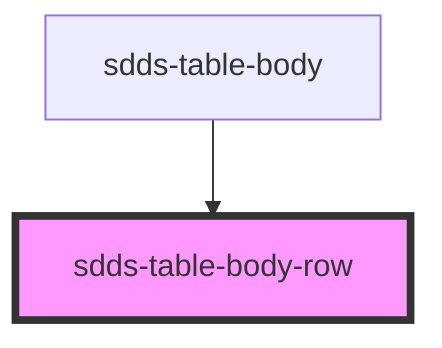

# sdds-table-body-row

<!-- Auto Generated Below -->

## Events

| Event            | Description                                                                                                      | Type                  |
| ---------------- | ---------------------------------------------------------------------------------------------------------------- | --------------------- |
| `sddsPagination` | Event that triggers pagination function. Needed as first rows have to be rendered in order for pagination to run | `CustomEvent<string>` |

## Dependencies

### Used by

 - [sdds-table-body](../table-body)

### Graph

----------------------------------------------

*Built with [StencilJS](https://stenciljs.com/)*
