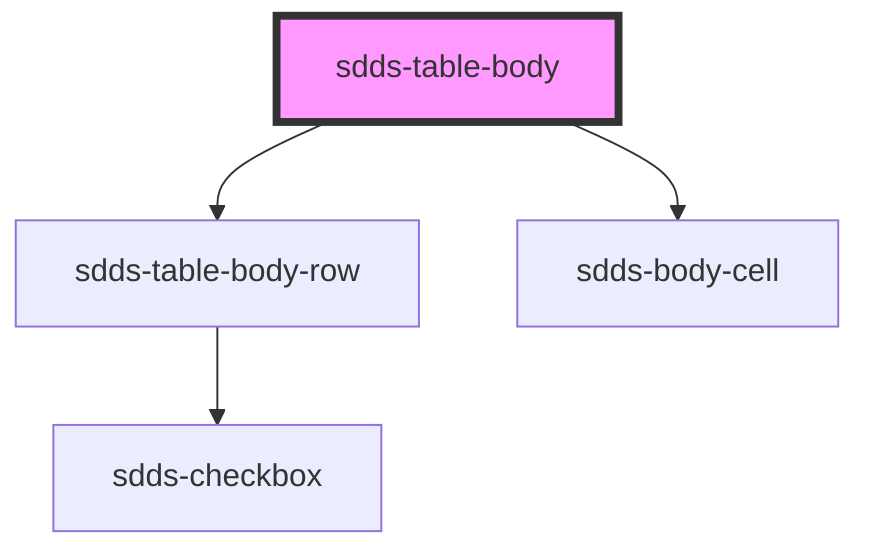

# sdds-table-body

<!-- Auto Generated Below -->

## Properties

| Property          | Attribute           | Description                                                                        | Type      | Default     |
| ----------------- | ------------------- | ---------------------------------------------------------------------------------- | --------- | ----------- |
| `bodyData`        | `body-data`         | Prop to pass JSON string which enables automatic rendering of table rows and cells | `any`     | `undefined` |
| `enableDummyData` | `enable-dummy-data` | Prop for showcase of rendering JSON in body-data, just for presentation purposes   | `boolean` | `false`     |

## Dependencies

### Depends on

- [sdds-table-body-row](../table-body-row)
- [sdds-body-cell](../table-body-cell)

### Graph

----------------------------------------------

*Built with [StencilJS](https://stenciljs.com/)*
