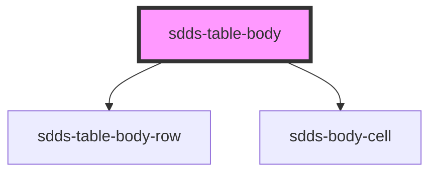

# sdds-table-body

<!-- Auto Generated Below -->

## Properties

| Property                   | Attribute                    | Description                                                                                                                                                             | Type      | Default     |
| -------------------------- | ---------------------------- | ----------------------------------------------------------------------------------------------------------------------------------------------------------------------- | --------- | ----------- |
| `bodyData`                 | `body-data`                  | Prop to pass JSON string which enables automatic rendering of table rows and cells                                                                                      | `any`     | `undefined` |
| `disableFilteringFunction` | `disable-filtering-function` | Disables inbuilt filtering logic, leaving user an option to create own filter functionality while listening to events from sdds-table-toolbar component for search term | `boolean` | `false`     |
| `enableDummyData`          | `enable-dummy-data`          | Prop for showcase of rendering JSON in body-data, just for presentation purposes                                                                                        | `boolean` | `false`     |

## Dependencies

### Depends on

- [sdds-table-body-row](../table-body-row)
- [sdds-body-cell](../table-body-cell)

### Graph

----------------------------------------------

*Built with [StencilJS](https://stenciljs.com/)*
