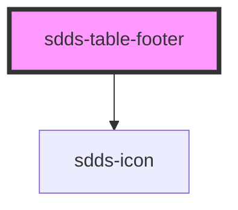

# sdds-table-footer

<!-- Auto Generated Below -->

## Properties

| Property                 | Attribute                   | Description                                                                                                                               | Type      | Default     |
| ------------------------ | --------------------------- | ----------------------------------------------------------------------------------------------------------------------------------------- | --------- | ----------- |
| `clientSetColumnsNumber` | `client-set-columns-number` | In case that automatic count of columns does not work, user can manually set this one. Take in mind that expandable control is column too | `number`  | `null`      |
| `maxPages`               | `max-pages`                 | Prop for client to set max number of pages.                                                                                               | `number`  | `undefined` |
| `pagination`             | `pagination`                | Enable pagination and show pagination controls                                                                                            | `boolean` | `false`     |
| `paginationValue`        | `pagination-value`          | Sets the pagination number.                                                                                                               | `number`  | `1`         |
| `rowsPerPage`            | `rows-per-page`             | Sets how many rows to display when pagination is enabled.                                                                                 | `number`  | `5`         |

## Events

| Event            | Description                                                                                                                           | Type                                                         |
| ---------------- | ------------------------------------------------------------------------------------------------------------------------------------- | ------------------------------------------------------------ |
| `sddsPageChange` | Event to send current page value to sdds-table-body component, can also be listened to in order to implement custom pagination logic. | `CustomEvent<{ tableId: string; paginationValue: number; }>` |

## Dependencies

### Depends on

- [sdds-icon](../../icon)

### Graph

----------------------------------------------

*Built with [StencilJS](https://stenciljs.com/)*
