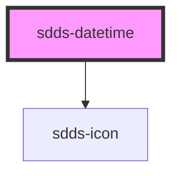

# sdds-textfield

<!-- Auto Generated Below -->

## Properties

| Property       | Attribute       | Description                                                                                                             | Type                                   | Default            |
| -------------- | --------------- | ----------------------------------------------------------------------------------------------------------------------- | -------------------------------------- | ------------------ |
| `autofocus`    | `autofocus`     | Autofocus for input                                                                                                     | `boolean`                              | `false`            |
| `defaultValue` | `default-value` | Default value of the component. Format for time: HH-MM. Format for date: YY-MM-DD. Format for date-time: YY-MM-DDTHH-MM | `string`                               | `'none'`           |
| `disabled`     | `disabled`      | Set input in disabled state                                                                                             | `boolean`                              | `false`            |
| `helper`       | `helper`        | Helper text for the component                                                                                           | `string`                               | `''`               |
| `label`        | `label`         | Label text for the component                                                                                            | `string`                               | `''`               |
| `modeVariant`  | `mode-variant`  | Set the variant of the datetime component.                                                                              | `"primary" \| "secondary"`             | `null`             |
| `name`         | `name`          | Name property                                                                                                           | `string`                               | `''`               |
| `noMinWidth`   | `no-min-width`  | Resets min width rule                                                                                                   | `boolean`                              | `false`            |
| `size`         | `size`          | Size of the input                                                                                                       | `"lg" \| "md" \| "sm"`                 | `'lg'`             |
| `state`        | `state`         | Error state of input                                                                                                    | `string`                               | `undefined`        |
| `type`         | `type`          | Which input type, text, password or similar                                                                             | `"date" \| "datetime-local" \| "time"` | `'datetime-local'` |
| `value`        | `value`         | Value of the input text                                                                                                 | `string`                               | `''`               |

## Events

| Event        | Description                   | Type                      |
| ------------ | ----------------------------- | ------------------------- |
| `sddsBlur`   | Blur event for the datetime   | `CustomEvent<FocusEvent>` |
| `sddsChange` | Change event for the datetime | `CustomEvent<any>`        |
| `sddsFocus`  | Focus event for the datetime  | `CustomEvent<FocusEvent>` |

## Dependencies

### Depends on

- [sdds-icon](../icon)

### Graph

----------------------------------------------

*Built with [StencilJS](https://stenciljs.com/)*
