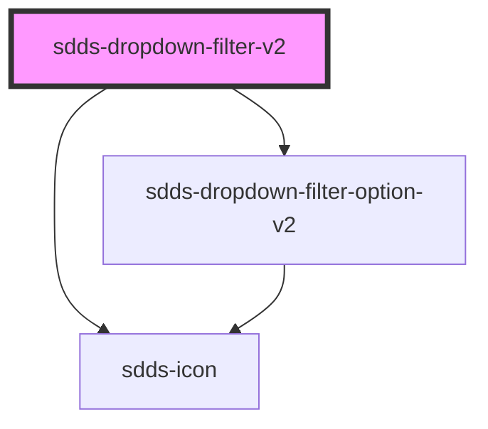

# dropdown-filter-v2

<!-- Auto Generated Below -->

## Properties

| Property        | Attribute        | Description                                                                                          | Type                       | Default       |
| --------------- | ---------------- | ---------------------------------------------------------------------------------------------------- | -------------------------- | ------------- |
| `data`          | `data`           | Data is an array of objects that contains label and value that will be rendered as dropdown-options. | `string`                   | `null`        |
| `error`         | `error`          | Error state for the component,                                                                       | `boolean`                  | `false`       |
| `helper`        | `helper`         | Helper text in the bottom of dropdown                                                                | `string`                   | `undefined`   |
| `label`         | `label`          | Label text                                                                                           | `string`                   | `undefined`   |
| `modeVariant`   | `mode-variant`   |                                                                                                      | `"primary" \| "secondary"` | `'primary'`   |
| `noResultText`  | `no-result-text` |                                                                                                      | `string`                   | `'No result'` |
| `open`          | `open`           | Open state of the dropdown                                                                           | `boolean`                  | `false`       |
| `openDirection` | `open-direction` | Direction that the dropdown will open. By default set to auto.                                       | `"auto" \| "down" \| "up"` | `'down'`      |
| `placeholder`   | `placeholder`    | Placeholder for the dropdown                                                                         | `string`                   | `undefined`   |
| `size`          | `size`           | The size of the component                                                                            | `"lg" \| "md" \| "sm"`     | `'lg'`        |
| `value`         | `value`          | The value of the dropdown - selected option value.                                                   | `string`                   | `undefined`   |

## Dependencies

### Depends on

- [sdds-icon](../icon)
- [sdds-dropdown-filter-option-v2](dropdown-filter-option-v2)

### Graph

----------------------------------------------

*Built with [StencilJS](https://stenciljs.com/)*
