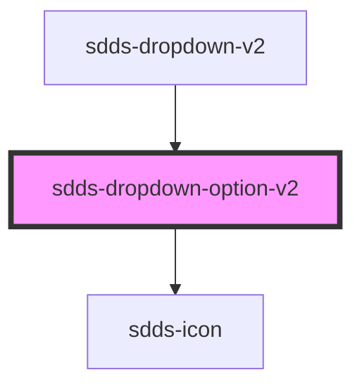

# dropdown-option-v2

<!-- Auto Generated Below -->

## Properties

| Property   | Attribute  | Description | Type                   | Default     |
| ---------- | ---------- | ----------- | ---------------------- | ----------- |
| `disabled` | `disabled` |             | `boolean`              | `false`     |
| `label`    | `label`    |             | `string`               | `undefined` |
| `selected` | `selected` |             | `boolean`              | `false`     |
| `size`     | `size`     |             | `"lg" \| "md" \| "sm"` | `'lg'`      |
| `value`    | `value`    |             | `string`               | `undefined` |

## Dependencies

### Used by

 - [sdds-dropdown-v2](..)

### Depends on

- [sdds-icon](../../icon)

### Graph

----------------------------------------------

*Built with [StencilJS](https://stenciljs.com/)*
