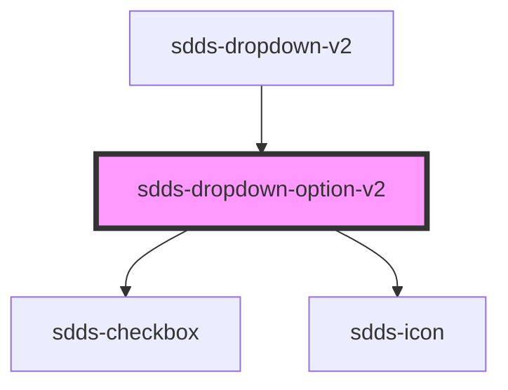

# sdds-dropdown-option-v2

<!-- Auto Generated Below -->

## Properties

| Property   | Attribute  | Description                                  | Type      | Default     |
| ---------- | ---------- | -------------------------------------------- | --------- | ----------- |
| `disabled` | `disabled` | Sets the dropdown option in a disabled state | `boolean` | `false`     |
| `label`    | `label`    | Label text for the dropdown                  | `string`  | `undefined` |
| `selected` | `selected` | Sets the dropdown option in a selected state | `boolean` | `false`     |

## Dependencies

### Used by

 - [sdds-dropdown-v2](..)

### Depends on

- [sdds-checkbox](../../checkbox)
- [sdds-icon](../../icon)

### Graph

----------------------------------------------

*Built with [StencilJS](https://stenciljs.com/)*
