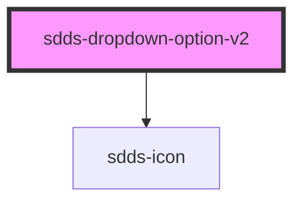

# sdds-dropdown-option-v2

<!-- Auto Generated Below -->

## Properties

| Property   | Attribute  | Description | Type      | Default     |
| ---------- | ---------- | ----------- | --------- | ----------- |
| `disabled` | `disabled` |             | `boolean` | `undefined` |
| `selected` | `selected` |             | `boolean` | `undefined` |
| `value`    | `value`    |             | `string`  | `undefined` |

## Dependencies

### Depends on

- [sdds-icon](../../icon)

### Graph

----------------------------------------------

*Built with [StencilJS](https://stenciljs.com/)*
