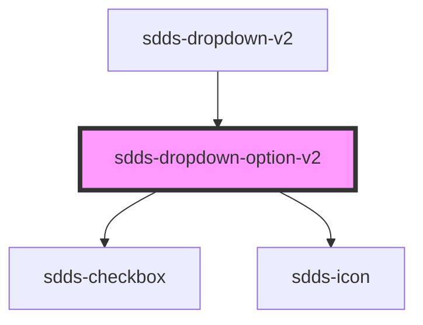

# sdds-dropdown-option-v2

<!-- Auto Generated Below -->

## Properties

| Property   | Attribute   | Description                            | Type      | Default     |
| ---------- | ----------- | -------------------------------------- | --------- | ----------- |
| `disabled` | `disabled`  | Sets the dropdown options as disabled. | `boolean` | `false`     |
| `parentEl` | `parent-el` |                                        | `any`     | `undefined` |
| `value`    | `value`     | Value for the dropdown option.         | `string`  | `undefined` |

## Events

| Event        | Description                          | Type                                                 |
| ------------ | ------------------------------------ | ---------------------------------------------------- |
| `sddsBlur`   | Blur event for the dropdown option.  | `CustomEvent<FocusEvent>`                            |
| `sddsFocus`  | Focus event for the dropdown option. | `CustomEvent<FocusEvent>`                            |
| `sddsSelect` | Click event for the dropdown option. | `CustomEvent<{ selected: boolean; value: string; }>` |

## Methods

### `deselect() => Promise<void>`

Method to deselect the dropdown option.

#### Returns

Type: `Promise<void>`

### `select() => Promise<void>`

Method to select the dropdown option.

#### Returns

Type: `Promise<void>`

## Dependencies

### Used by

 - [sdds-dropdown-v2](..)

### Depends on

- [sdds-checkbox](../../checkbox)
- [sdds-icon](../../icon)

### Graph

----------------------------------------------

*Built with [StencilJS](https://stenciljs.com/)*
