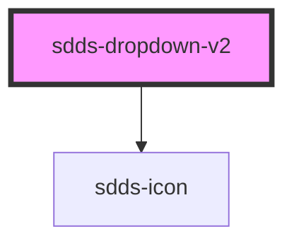

# sdds-dropdown-v2

<!-- Auto Generated Below -->

## Properties

| Property        | Attribute        | Description | Type                       | Default     |
| --------------- | ---------------- | ----------- | -------------------------- | ----------- |
| `disabled`      | `disabled`       |             | `boolean`                  | `undefined` |
| `error`         | `error`          |             | `boolean`                  | `undefined` |
| `filter`        | `filter`         |             | `boolean`                  | `undefined` |
| `helper`        | `helper`         |             | `string`                   | `undefined` |
| `label`         | `label`          |             | `string`                   | `undefined` |
| `labelPosition` | `label-position` |             | `"inside" \| "outside"`    | `undefined` |
| `modeVariant`   | `mode-variant`   |             | `"primary" \| "secondary"` | `undefined` |
| `multiselect`   | `multiselect`    |             | `boolean`                  | `undefined` |
| `name`          | `name`           |             | `string`                   | `undefined` |
| `openDirection` | `open-direction` |             | `"auto" \| "down" \| "up"` | `'auto'`    |
| `placeholder`   | `placeholder`    |             | `string`                   | `undefined` |
| `size`          | `size`           |             | `"lg" \| "md" \| "sm"`     | `'lg'`      |
| `success`       | `success`        |             | `boolean`                  | `undefined` |

## Dependencies

### Depends on

- [sdds-icon](../icon)

### Graph

----------------------------------------------

*Built with [StencilJS](https://stenciljs.com/)*
