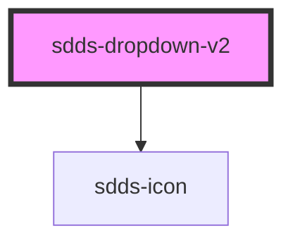

# sdds-dropdown-v2

<!-- Auto Generated Below -->

## Properties

| Property        | Attribute        | Description                                                    | Type                       | Default     |
| --------------- | ---------------- | -------------------------------------------------------------- | -------------------------- | ----------- |
| `disabled`      | `disabled`       | Sets the dropdown in a disabled state                          | `boolean`                  | `undefined` |
| `error`         | `error`          | Sets the dropdown in an error state                            | `boolean`                  | `undefined` |
| `filter`        | `filter`         | Enables filtration in the dropdown.                            | `boolean`                  | `undefined` |
| `helper`        | `helper`         | Helper text for the dropdown.                                  | `string`                   | `undefined` |
| `label`         | `label`          | Label text for the dropdown.                                   | `string`                   | `undefined` |
| `labelPosition` | `label-position` | Label text position                                            | `"inside" \| "outside"`    | `undefined` |
| `modeVariant`   | `mode-variant`   |                                                                | `"primary" \| "secondary"` | `undefined` |
| `multiselect`   | `multiselect`    | Enables multiselect in the dropdown.                           | `boolean`                  | `undefined` |
| `name`          | `name`           | Name for the dropdowns input element.                          | `string`                   | `undefined` |
| `openDirection` | `open-direction` | The direction the dropdown should open, auto if not specified. | `"auto" \| "down" \| "up"` | `'auto'`    |
| `placeholder`   | `placeholder`    | Placeholder text for the dropdown.                             | `string`                   | `undefined` |
| `size`          | `size`           | The size of the dropdown.                                      | `"lg" \| "md" \| "sm"`     | `'lg'`      |
| `success`       | `success`        | Sets the dropdown in a success state                           | `boolean`                  | `undefined` |

## Methods

### `close() => Promise<void>`

Method for closing the dropdown.

#### Returns

Type: `Promise<void>`

## Dependencies

### Depends on

- [sdds-icon](../icon)

### Graph

----------------------------------------------

*Built with [StencilJS](https://stenciljs.com/)*
