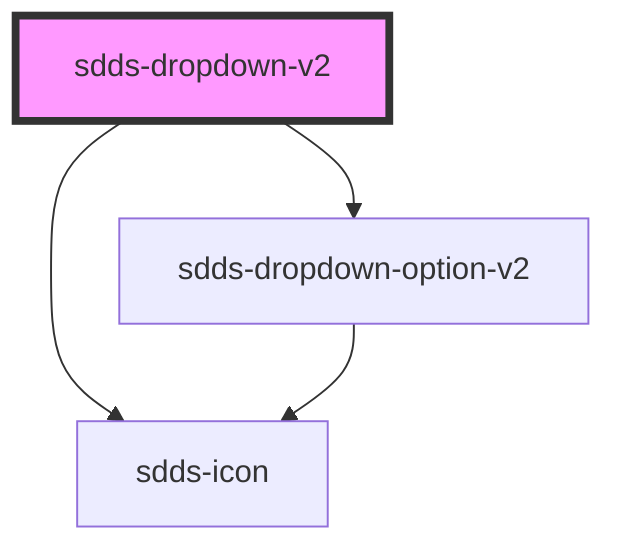

# dropdown-v2

<!-- Auto Generated Below -->

## Properties

| Property        | Attribute        | Description                                                    | Type                                  | Default         |
| --------------- | ---------------- | -------------------------------------------------------------- | ------------------------------------- | --------------- |
| `data`          | `data`           |                                                                | `string`                              | `null`          |
| `label`         | `label`          |                                                                | `string`                              | `'Placeholder'` |
| `labelPosition` | `label-position` | Controls position of label                                     | `"inside" \| "no-label" \| "outside"` | `'outside'`     |
| `open`          | `open`           |                                                                | `boolean`                             | `false`         |
| `openDirection` | `open-direction` | Direction that the dropdown will open. By default set to auto. | `"auto" \| "down" \| "up"`            | `'up'`          |
| `placeholder`   | `placeholder`    |                                                                | `string`                              | `undefined`     |
| `size`          | `size`           |                                                                | `"lg" \| "md" \| "sm"`                | `'lg'`          |
| `state`         | `state`          |                                                                | `"error" \| "none"`                   | `'none'`        |
| `value`         | `value`          |                                                                | `string`                              | `undefined`     |

## Dependencies

### Depends on

- [sdds-icon](../icon)
- [sdds-dropdown-option-v2](dropdown-option-v2)

### Graph

----------------------------------------------

*Built with [StencilJS](https://stenciljs.com/)*
