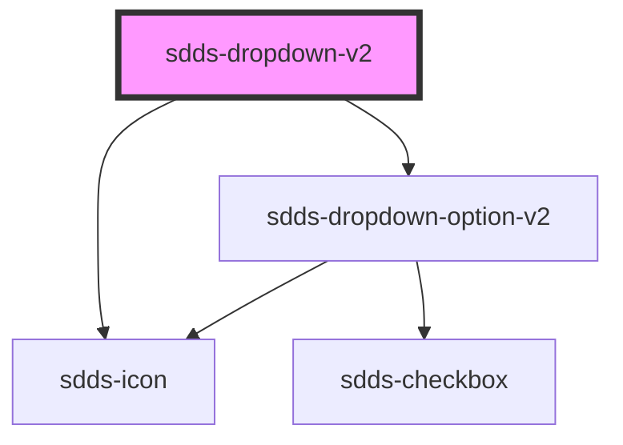

# sdds-dropdown-v2

The dropdown can be populated with options either by passing the `<sdds-dropdown-option>` as a child to the element. Or by specifying a data property on the element.
This property should be a JSON array containing objects of the following structure:

```json
{ 
  "value": string;
  "label": any;
  "disabled": boolean; 
}
```


<!-- Auto Generated Below -->


## Properties

| Property        | Attribute        | Description                                                                                | Type                       | Default       |
| --------------- | ---------------- | ------------------------------------------------------------------------------------------ | -------------------------- | ------------- |
| `data`          | `data`           | Populate the dropdown via a JSON array                                                     | `string`                   | `undefined`   |
| `defaultValue`  | `default-value`  | Default value selected in the dropdown.                                                    | `string`                   | `undefined`   |
| `disabled`      | `disabled`       | Sets the dropdown in a disabled state                                                      | `boolean`                  | `false`       |
| `error`         | `error`          | Sets the dropdown in an error state                                                        | `boolean`                  | `false`       |
| `filter`        | `filter`         | Enables filtration in the dropdown.                                                        | `boolean`                  | `false`       |
| `helper`        | `helper`         | Helper text for the dropdown.                                                              | `string`                   | `undefined`   |
| `label`         | `label`          | Label text for the dropdown.                                                               | `string`                   | `undefined`   |
| `labelPosition` | `label-position` | Label text position                                                                        | `"inside" \| "outside"`    | `undefined`   |
| `modeVariant`   | `mode-variant`   | Mode variant of the component, based on current mode.                                      | `"primary" \| "secondary"` | `null`        |
| `multiselect`   | `multiselect`    | Enables multiselect in the dropdown.                                                       | `boolean`                  | `false`       |
| `name`          | `name`           | Name for the dropdowns input element.                                                      | `string`                   | `undefined`   |
| `noResultText`  | `no-result-text` | Text that is displayed if filter is used and there are no options that matches the search. | `string`                   | `'No result'` |
| `openDirection` | `open-direction` | The direction the dropdown should open, auto if not specified.                             | `"auto" \| "down" \| "up"` | `'auto'`      |
| `placeholder`   | `placeholder`    | Placeholder text for the dropdown.                                                         | `string`                   | `undefined`   |
| `size`          | `size`           | The size of the dropdown.                                                                  | `"lg" \| "md" \| "sm"`     | `'lg'`        |


## Events

| Event        | Description                    | Type                                            |
| ------------ | ------------------------------ | ----------------------------------------------- |
| `sddsChange` | Change event for the dropdown. | `CustomEvent<{ name: string; value: string; }>` |


## Methods

### `close() => Promise<void>`

Method for closing the dropdown.

#### Returns

Type: `Promise<void>`


### `reset() => Promise<void>`

Method that resets the dropdown.

#### Returns

Type: `Promise<void>`


## Dependencies

### Depends on

- [sdds-icon](../icon)
- [sdds-dropdown-option-v2](dropdown-option-v2)

### Graph


----------------------------------------------

*Built with [StencilJS](https://stenciljs.com/)*
