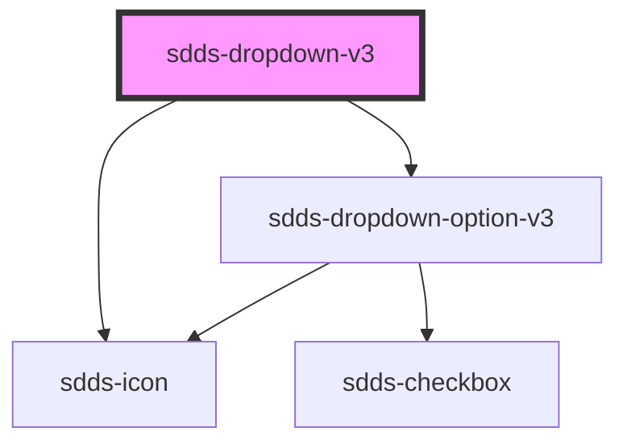

# dropdown-v3

<!-- Auto Generated Below -->

## Properties

| Property        | Attribute        | Description                                                                                                                                                                                      | Type                                  | Default               |
| --------------- | ---------------- | ------------------------------------------------------------------------------------------------------------------------------------------------------------------------------------------------ | ------------------------------------- | --------------------- |
| `data`          | `data`           | Data is an array of objects that contains label and value that will be rendered as dropdown-options.                                                                                             | `string`                              | `undefined`           |
| `dropdownId`    | `dropdown-id`    | ID for the dropdown.  **NOTE**: If you're listening for dropdown events you need to set this ID yourself to identify the dropdown, as the default ID is random and will be different every time. | `string`                              | `crypto.randomUUID()` |
| `error`         | `error`          | Error state for the component,                                                                                                                                                                   | `boolean`                             | `false`               |
| `filter`        | `filter`         | Adds filter ability to component.                                                                                                                                                                | `boolean`                             | `undefined`           |
| `helper`        | `helper`         | Helper text in the bottom of dropdown                                                                                                                                                            | `string`                              | `undefined`           |
| `label`         | `label`          | Label text                                                                                                                                                                                       | `string`                              | `undefined`           |
| `labelPosition` | `label-position` | Controls position of label                                                                                                                                                                       | `"inside" \| "no-label" \| "outside"` | `'outside'`           |
| `modeVariant`   | `mode-variant`   | Variant of the component based on current mode.                                                                                                                                                  | `"primary" \| "secondary"`            | `null`                |
| `multiselect`   | `multiselect`    | Adds multiselect ability to component.                                                                                                                                                           | `boolean`                             | `undefined`           |
| `name`          | `name`           | The name for the dropdowns input element.                                                                                                                                                        | `string`                              | `undefined`           |
| `noResultText`  | `no-result-text` | If filter option is true, this is the text displayed when the search returns no options.                                                                                                         | `string`                              | `'No result'`         |
| `open`          | `open`           | Open state of the dropdown                                                                                                                                                                       | `boolean`                             | `false`               |
| `openDirection` | `open-direction` | Direction that the dropdown will open. By default set to auto.                                                                                                                                   | `"auto" \| "down" \| "up"`            | `'up'`                |
| `placeholder`   | `placeholder`    | Placeholder text                                                                                                                                                                                 | `string`                              | `undefined`           |
| `size`          | `size`           | The size of the component                                                                                                                                                                        | `"lg" \| "md" \| "sm"`                | `'lg'`                |

## Events

| Event            | Description | Type                                                                               |
| ---------------- | ----------- | ---------------------------------------------------------------------------------- |
| `dropdownSelect` |             | `CustomEvent<{ dropdownId: string; value: { value: string; label: string; }[]; }>` |

## Dependencies

### Depends on

- [sdds-icon](../icon)
- [sdds-dropdown-option-v3](dropdown-option-v3)

### Graph

----------------------------------------------

*Built with [StencilJS](https://stenciljs.com/)*
