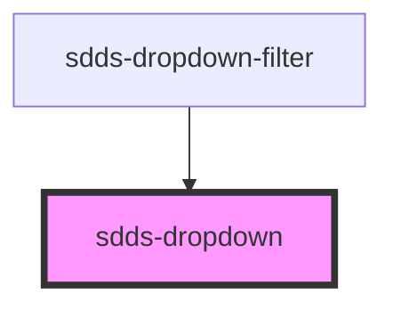

# Dropdown

<!-- Auto Generated Below -->

## Properties

| Property         | Attribute         | Description                                                                                                        | Type                                                     | Default      |
| ---------------- | ----------------- | ------------------------------------------------------------------------------------------------------------------ | -------------------------------------------------------- | ------------ |
| `defaultOption`  | `default-option`  | Add the value of the option as string to set it as default                                                         | `string`                                                 | `undefined`  |
| `disabled`       | `disabled`        | Set to true for disabled states                                                                                    | `boolean`                                                | `false`      |
| `helper`         | `helper`          | Add helper text in the bottom of dropdown                                                                          | `string`                                                 | `''`         |
| `inline`         | `inline`          | Set to true to make the width following the label text length                                                      | `boolean`                                                | `false`      |
| `label`          | `label`           | Label text for label inside & outside                                                                              | `string`                                                 | `undefined`  |
| `labelPosition`  | `label-position`  | Controls position of label                                                                                         | `"inside" \| "no-label" \| "outside"`                    | `'no-label'` |
| `modeVariant`    | `mode-variant`    | Set the variant of the dropdown.                                                                                   | `"primary" \| "secondary"`                               | `null`       |
| `openDirection`  | `open-direction`  | Direction that the dropdown will open. Default is auto.                                                            | `"auto" \| "down" \| "up"`                               | `'auto'`     |
| `placeholder`    | `placeholder`     | Placeholder text for dropdown with no selectedLabel item                                                           | `string`                                                 | `undefined`  |
| `selectedOption` | `selected-option` | Add the value of the option as string to set it as new selected value                                              | `string`                                                 | `undefined`  |
| `size`           | `size`            | Controls the size of dropdown. 'sm', 'md' and 'lg' correct values and 'small', 'medium' and 'large' are deprecated | `"large" \| "lg" \| "md" \| "medium" \| "sm" \| "small"` | `'lg'`       |
| `state`          | `state`           | Support `error` state                                                                                              | `boolean`                                                | `false`      |
| `type`           | `type`            | `Controls type of dropdown.                                                                                        | `"default" \| "filter" \| "multiselect"`                 | `'default'`  |

## Methods

### `resetOption() => Promise<void>`

#### Returns

Type: `Promise<void>`

## Dependencies

### Used by

 - [sdds-dropdown-filter](dropdown-filter)

### Graph

----------------------------------------------

*Built with [StencilJS](https://stenciljs.com/)*
