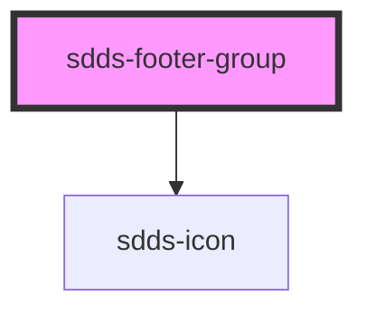

# sdds-footer-group

<!-- Auto Generated Below -->

## Properties

| Property    | Attribute    | Description                                                      | Type     | Default     |
| ----------- | ------------ | ---------------------------------------------------------------- | -------- | ----------- |
| `titleText` | `title-text` | Title text for the link group, only valid on top part of footer. | `string` | `undefined` |

## Dependencies

### Depends on

- [sdds-icon](../../../icon)

### Graph

----------------------------------------------

*Built with [StencilJS](https://stenciljs.com/)*
