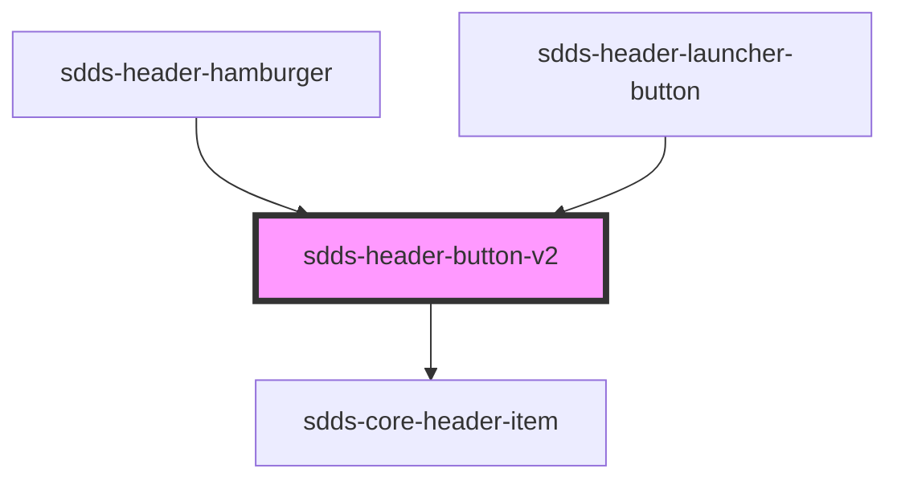

# header-button

<!-- Auto Generated Below -->

## Dependencies

### Used by

 - [sdds-header-hamburger](../header-hamburger)
 - [sdds-header-launcher-button](../header-launcher-button)

### Depends on

- [sdds-core-header-item](../core-header-item)

### Graph

----------------------------------------------

*Built with [StencilJS](https://stenciljs.com/)*
