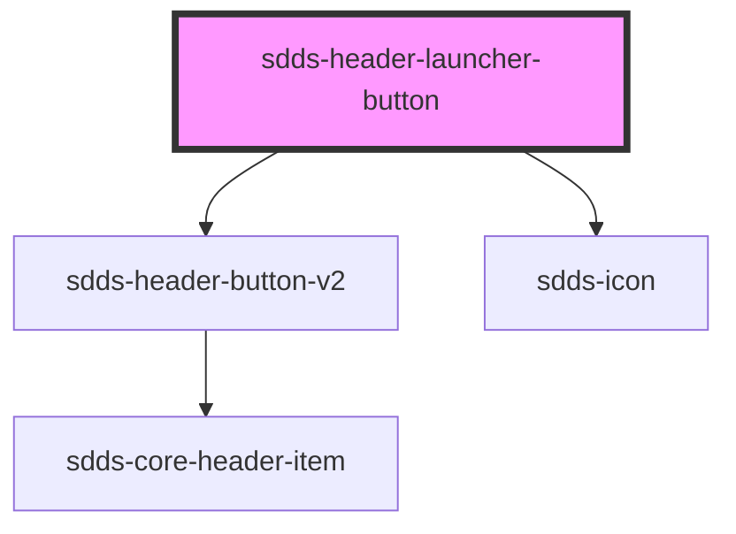

# sdds-header-launcher-button

<!-- Auto Generated Below -->

## Dependencies

### Depends on

- [sdds-header-button-v2](../header-button-alt)
- [sdds-icon](../../../icon)

### Graph

----------------------------------------------

*Built with [StencilJS](https://stenciljs.com/)*
