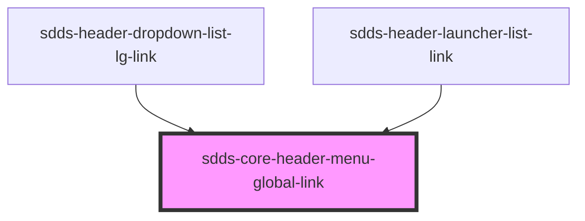

# sdds-header-launcher-list-link

<!-- Auto Generated Below -->

## Properties

| Property            | Attribute | Description | Type     | Default      |
| ------------------- | --------- | ----------- | -------- | ------------ |
| `href` _(required)_ | `href`    |             | `string` | `undefined`  |
| `rel`               | `rel`     |             | `string` | `'noopener'` |
| `target`            | `target`  |             | `string` | `undefined`  |

## Shadow Parts

| Part  | Description |
| ----- | ----------- |
| `"a"` |             |

## Dependencies

### Used by

 - [sdds-header-dropdown-list-lg-link](../header-dropdown-list-lg-link)
 - [sdds-header-launcher-list-link](../header-launcher-list-link)

### Graph

----------------------------------------------

*Built with [StencilJS](https://stenciljs.com/)*
