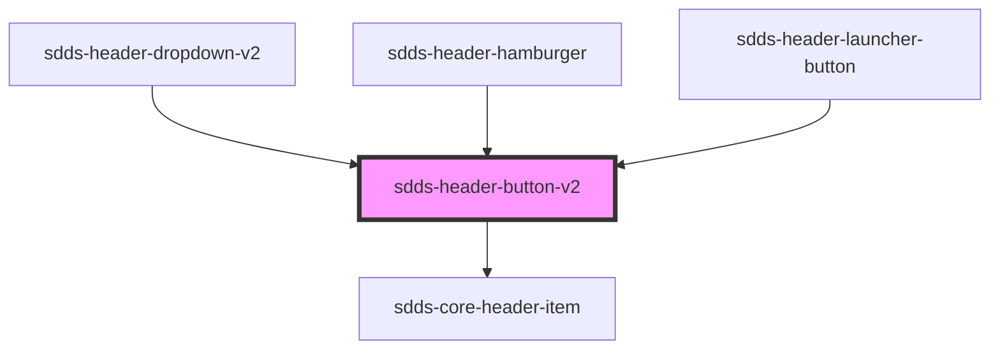

# header-button

<!-- Auto Generated Below -->

## Properties

| Property   | Attribute   | Description | Type      | Default |
| ---------- | ----------- | ----------- | --------- | ------- |
| `isActive` | `is-active` |             | `boolean` | `false` |

## Dependencies

### Used by

 - [sdds-header-dropdown-v2](../header-dropdown-v2)
 - [sdds-header-hamburger](../header-hamburger)
 - [sdds-header-launcher-button](../header-launcher-button)

### Depends on

- [sdds-core-header-item](../core-header-item)

### Graph

----------------------------------------------

*Built with [StencilJS](https://stenciljs.com/)*
