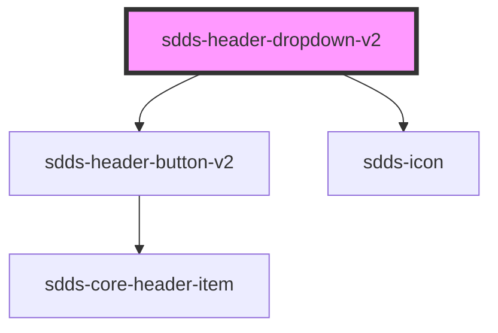

# sdds-header-dropdown-v2

<!-- Auto Generated Below -->

## Properties

| Property         | Attribute          | Description                                                | Type               | Default     |
| ---------------- | ------------------ | ---------------------------------------------------------- | ------------------ | ----------- |
| `active`         | `active`           |                                                            | `boolean`          | `false`     |
| `buttonLabel`    | `button-label`     |                                                            | `string`           | `undefined` |
| `noDropdownIcon` | `no-dropdown-icon` |                                                            | `boolean`          | `false`     |
| `open`           | `open`             | Opens and closes the dropdown                              | `boolean`          | `false`     |
| `placement`      | `placement`        | Placement of the dropdown menu relative to the button TODO | `"end" \| "start"` | `'start'`   |

## Dependencies

### Depends on

- [sdds-header-button-v2](../header-button-alt)
- [sdds-icon](../../../icon)

### Graph

----------------------------------------------

*Built with [StencilJS](https://stenciljs.com/)*
