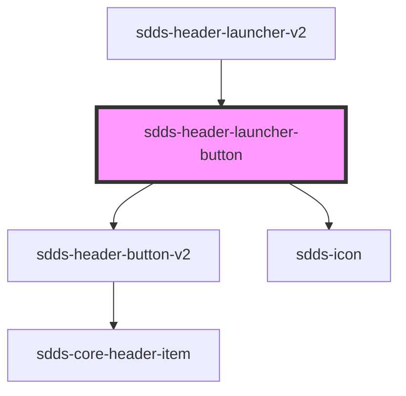

# sdds-header-launcher-button

<!-- Auto Generated Below -->

## Properties

| Property   | Attribute   | Description | Type      | Default |
| ---------- | ----------- | ----------- | --------- | ------- |
| `isActive` | `is-active` |             | `boolean` | `false` |

## Dependencies

### Used by

 - [sdds-header-launcher-v2](../header-launcher)

### Depends on

- [sdds-header-button-v2](../header-button-alt)
- [sdds-icon](../../../icon)

### Graph

----------------------------------------------

*Built with [StencilJS](https://stenciljs.com/)*
